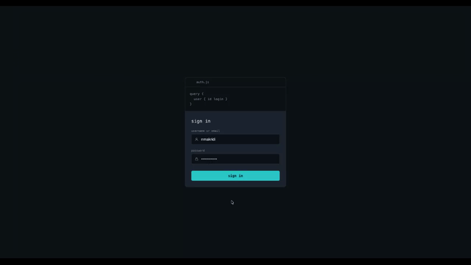

# GraphQL Profile



A personal profile page built by querying the school's GraphQL API. The project covers authentication with JWT, GraphQL querying (standard, nested and argument-based), a profile UI, and SVG-based statistics graphs — hosted as a static site.

## Overview

This profile pulls data directly from the platform's GraphQL endpoint and displays it across a login page and a profile dashboard. No framework is used — the entire app is built with vanilla HTML, CSS and JavaScript.

## Features

### Authentication
- Login page supporting both `username:password` and `email:password`
- Credentials sent via Basic authentication (base64-encoded) to the signin endpoint
- JWT stored and used for all subsequent GraphQL requests via Bearer authentication
- Clear error message on invalid credentials
- Logout functionality

### GraphQL data layer
Queries the platform's GraphQL endpoint using all three required query styles:
- **Standard queries** — e.g. fetching the authenticated user's basic details
- **Nested queries** — e.g. results joined with their related user or object data
- **Argument-based queries** — e.g. filtering transactions by type or ordering by date

### GraphiQL console
A self-built query console (`js/queryConsole.js`), separate from the platform's own hosted GraphiQL, is embedded at the bottom of the profile page:
- Free-text textarea to run any GraphQL query against the live endpoint, using the same authenticated request path as every chart on the page
- One-click example buttons that load the exact standard, nested and argument-based query strings used elsewhere in the app, plus a "your audit stats" query built from the logged-in user's own id
- Lets any query result be checked live against what a given chart or stat displays

### Profile UI
Displays user information including:
- Basic identification (id, login)
- XP amount (scoped to the Fellowship path, excluding the JS piscine)
- Additional data points, chosen to complement the statistics below: developer level and title, level milestone timeline, audit ratio, project PASS/FAIL rate, and piscine PASS/FAIL with attempts per exercise (grouped dynamically per piscine, e.g. JS/Go)

### Statistics (SVG)
At least two graphs are required by the brief; this project includes five, combining interactive and animated SVG:

| Graph | Type |
|---|---|
| XP earned over time | Animated line/area chart |
| XP earned by project | Squarified treemap |
| Skill levels (technologies / technical skills) | Radar chart |
| Audits given vs received | Segmented bar chart |
| Given/received audits by outcome | Segmented bar charts (interactive tooltips) |

## Tech stack

- HTML, CSS, JavaScript (no framework)
- SVG for all graphs (hand-built, no charting library)
- Hosted as a static site
- Containerized with Docker (nginx:alpine)

## Project structure

```
graphql-profile/
├── .github/
│   └── copilot-instructions.md  # Copilot review-only persona (see Tooling section)
├── Dockerfile
├── GraphQL.gif
├── index.html
├── css/
│   └── style.css
├── js/
│   ├── auth.js              # signin, JWT storage/decode, view switching, section rendering
│   ├── api.js                # GraphQL query functions, response caching
│   ├── matrixBg.js             # animated canvas background
│   ├── queryConsole.js          # self-built GraphiQL-style query console
│   └── charts/
│       ├── xpOverTime.js        # XP-over-time line/area chart
│       ├── xpByProject.js        # XP-by-project treemap
│       ├── levelMilestones.js     # level milestone timeline
│       ├── skillMatrix.js          # skill radar charts
│       └── piscineStats.js          # piscine exercise breakdown
├── AUDIT.md
└── README.md
```

## Getting started

1. Clone the repository
2. Open `index.html` in a browser, or serve the folder with any static file server
3. Log in with your platform username/email and password
4. View your profile and statistics

## Running with Docker

The project can also be served via a containerized nginx instead of a local static file server.

1. Build the image:
   ```bash
   docker build -t graphql-profile .
   ```
2. Run it, mapping container port 80 to a local port:
   ```bash
   docker run -d -p 8080:80 --name graphql-profile graphql-profile
   ```
3. Open [http://localhost:8080](http://localhost:8080)

Stop and remove the container when done:
```bash
docker stop graphql-profile && docker rm graphql-profile
```

## API reference

- GraphQL endpoint: `https://learn.01founders.co/api/graphql-engine/v1/graphql`
- Signin endpoint: `https://learn.01founders.co/api/auth/signin`

## What this project covers

- GraphQL and GraphiQL
- JWT-based authentication and authorisation
- Basics of human-computer interface and UI/UX
- Static site hosting

## Tooling & Copilot Integration

* **AI Code Coaching:** A [`.github/copilot-instructions.md`](.github/copilot-instructions.md) configuration is included to tailor GitHub Copilot's behaviour in this repo (CLI and IDE).
* **Purpose:** It puts Copilot into a review-only mode — categorised performance, security, architecture, and infrastructure feedback with a "mental model" explanation per finding — and explicitly forbids it from generating or rewriting code.

## Hosting

This project is hosted on GitHub Pages: [https://nikomakr.github.io/graphql/](https://nikomakr.github.io/graphql/)